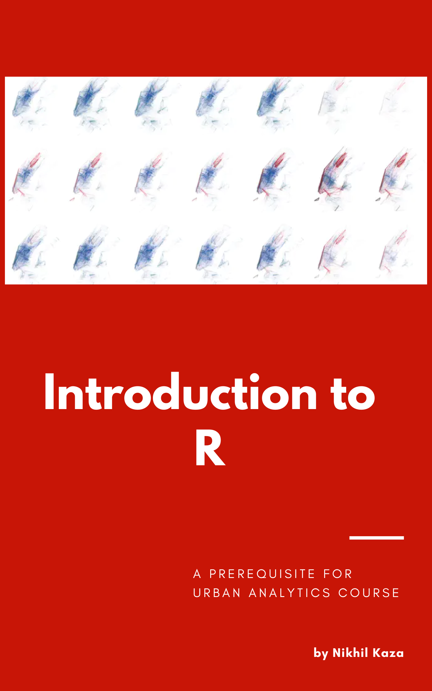

--- 
title: "An Introduction to R"
author: "Nikhil Kaza"
date: "`r gsub(' 0', ' ', format(Sys.Date(), '%B %d, %Y'))`"
site: bookdown::bookdown_site
output: bookdown::gitbook
always_allow_html: true
documentclass: book
#bibliography: [book.bib, packages.bib]
#biblio-style: apalike
link-citations: yes
colorlinks: yes
geometry: "left=3cm,right=3cm,top=2cm,bottom=2cm"
fontsize: 12pt
# monofont: "Source Code Pro"
#monofont: "SFMono"
#monofontoptions: "Scale=0.7"
# linestretch: 1.15
github-repo: "nkaza/intro2Rbook"
description: "A practical introduction to using R for data analysis"
url: 'https\://alexd106.github.io/Rbook/'
cover-image: "images/cover_v4.png"
---

```{r create_chunk_options1, include=FALSE}
source('utils.R')
newest.vers <- checkRversion()
```


```{r create_chunk_options2, include=FALSE, eval=knitr::is_latex_output()}
# source('scripts_and_filters/create_chunk_options.R')
source('wrap_lines.R')
```

# Preface{-}
\markboth{PREFACE}{}

```{r,echo=FALSE,fig.align="center",eval=knitr::is_html_output(), out.width='50%'}

```

----

## The aim of this book

This book is a derivative of  "[An Introduction to R](https://intro2r.com/)" by Alex Douglas, Deon Roos, Francesca Mancini, Ana Couto & David Lusseau". I have adapated it  in 2022 to make it suitable for students who are getting started with Urban Analytics course and want to have a refresher course in R. As such much of this book is verbatim from Douglas et. al(2022) with no claim to originality. The same license (CC-NC-SA) applies.

The aim of this book is to introduce you to using R, a powerful and flexible interactive environment for statistical computing and research. R in itself is not difficult to learn, but as with learning any new language (spoken or computer) the initial learning curve can be a little steep and somewhat daunting. We have tried to simplify the content of this book as much as possible. It is not intended to cover everything there is to know about R - that would be an impossible task. Neither is it intended to be an introductory statistics course, although you will be using some simple statistics to highlight some of R’s capabilities. The main aim of this book is to help you get over the initial learning hurdle and provide you with the basic skills and experience (and confidence!) to enable you to further your experience in using R.

## Who is this book for?

We hope this book will be a useful introduction for anyone who wants to learn how to use R. It is primarily intended for students who have some experience with programming and little experience with R. It is also intended for students, typically advanced undergraduates and graduate students, who are interested in urban analytics. I've also tried to make the content of this book operating system agnostic and have included information for Windows, Mac and Linux users where appropriate. 


## How to use this book

For the best experience we recommend that you read the web version of this book which you can find [here][book]. The web version includes a navbar at the top of the page where you can toggle the sidebar on and off `r icons::fontawesome('bars', style = 'solid')`, search through the book `r icons::fontawesome('search', style = 'solid')`, change the font, font size and page colour `r icons::fontawesome('font', style = 'solid')` and suggest revisions if you spot a typo or mistake `r icons::fontawesome('edit', style = 'solid')`. You can also download a pdf version of our book by clicking on the pdf icon `r icons::fontawesome('file-pdf', style = 'solid')`. 

We use a few typographical conventions throughout this book. 

R code and the resulting output are presented in code blocks in our book.

```{r, echo=TRUE, eval=TRUE, collapse=TRUE}
42 + 1 
```

If you're running R code in the R console it will look a little different from the code above. Code should be entered after the command prompt (`>`) and the output from code in the console will not be commented with `##`. 

```{r, echo=TRUE, collapse=TRUE, prompt=TRUE, comment=""}
42 + 1 
```

In the book text we refer to R functions using code font followed by a set of round brackets, i.e. `mean()` or `sd()` etc.

We refer to objects that we create using code font without the round brackets, i.e. `obj1`, `obj2` etc.

A series of actions required to access menu commands in RStudio are identified as `File` -> `New File` -> `R Script` which translates to 'click on the File menu, then click on New File and then select R Script'.

Clickable links to sections in the book or to external websites are highlighted in light blue text, i.e. [link][cran].

Links to short 'how-to' videos that accompany this book are indicated by a video `r icons::icon_style(icons::fontawesome(name = 'video', style = 'solid'), fill = "#165788", scale = 1.3)` icon.

Links to exercises can be found at the end of each Chapter and are highlighted by a info `r icons::icon_style(icons::fontawesome(name = 'info-circle', style = 'solid'), fill = "#416dde", scale = 1.3)` icon. 

## Book website

Although you can use this book as a standalone resource, we recommend you use it in conjunction with it's companion [website][course-web]. The course website contains a series of exercises which will help you practice writing R code and test your understanding of key concepts - you certainly won’t learn how to use R by watching other people do it (or reading a book about it!). The website also contains solutions for each of the exercises and a plethora of links to additional tutorials and resources. 

## Some R pointers


- Use R often and use it regularly - find any excuse to fire up RStudio (or just R) and get coding. This will help build and maintain all important momentum. 

- Learning R is not a memory test. One of the beauties of a scripting language is that you will always have your code to refer back to when you inevitably forget how to do something.

- You don't need to know everything there is to know about R to use it productively. If you get stuck, Google it, it's not cheating and writing a good search query is a skill in itself. Just make sure you check thoroughly that the code you find is doing what you want it to do.

- If you find yourself staring at code for hours trying to figure out why it's not working then walk away for a few minutes. We've lost count of the number of times we were able to spot our mistake almost immediately after returning from a short caffeine break.

- In R there are many ways to tackle a particular problem. If your code doesn't look like someone elses, but it does what you want it to do in a reasonable time and robustly then don't worry about it - job done. 

- Related to our previous point, remember R is just a tool to help you answer your interesting questions. Although it can be fun to immerse yourself in all things R, don't lose sight of what's important - your analytical question(s) and your data. No amount of skill using R will help if your data collection is fundamentally flawed or your question vague. 

- Recognise that there will be times when things will get a little tough or frustrating. Try to accept these periods as part of the natural process of learning a new skill (we've all been there) and remember, the time and energy you invest now will be more than payed back in the not too distant future.

Finally, once you've finished working your way through this book, we encourage you to practice what you've learned using your own data. If you don’t have any data yet, then ask your colleagues / friends / family for some (we're sure they will be delighted!) or follow one of the many excellent tutorials available on-line (see the course [website][course-web] for more details). Our suggestion to you, is that while you are getting to grips with R, uninstall any other statistics software you have on your computer and only use R. This may seem a little extreme but will hopefully remove the temptation to *‘just do it quickly’* in a more familiar environment and consequently slow down your learning of R. Believe us, anything you can do in your existing statistics software package you can do in R - often more robustly and efficiently. 

Good luck and don’t forget to have fun. 


## License

We want you to be able to enjoy this book completely free of charge so we've licensed it according to the Creative Commons Attribution-NonCommercial 4.0 International (CC BY-NC 4.0) License (https://creativecommons.org/licenses/by-nc/4.0/). 

If you teach R, feel free to use some or all of the content in this book to help support your own students. The only thing we ask is that you acknowledge the original source and authors. If you find this book useful or have any comments or suggestions we would love to hear from you (you'll find us lurking on [Twitter](#whoarewe) and [GitHub](#whoarewe)).

\  

*This is a human-readable summary of (and not a substitute for) the license. Please see <https://creativecommons.org/licenses/by-nc/4.0/legalcode> for the full legal text.*

**You are free to:**

- **Share**---copy and redistribute the material in any medium or
  format

- **Adapt**---remix, transform, and build upon the material

The licensor cannot revoke these freedoms as long as you follow the
license terms.

**Under the following terms:**

- **Attribution**---You must give appropriate credit, provide a link
  to the license, and indicate if changes were made. You may do so in
  any reasonable manner, but not in any way that suggests the licensor
  endorses you or your use.
  
- **NonCommercial**---You may not use the material for commercial purposes.

```{r links, child="links.md"}
```
